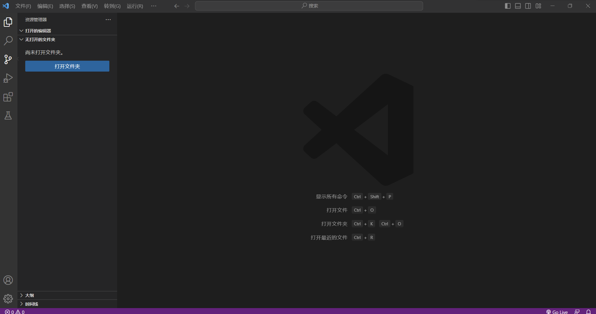
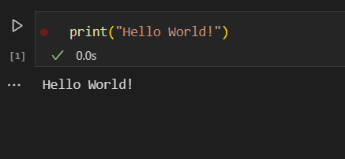

# 实验1 相关软件安装

 1. 安 装 Android Studio 4.1 之 上 的 版 本
 2. 安装Jupyter Notebook和相关的Python环境
 3. 安装Visual Studio Code代码编辑器
 4. 探索上述软件的使用
---
 ### 1. Android Studio及初步使用

 ####   安装完成截图


#### 应用探索——创建第一个Kotlin安卓文件

##### 步骤：

①File -> New -> New Project -> Empty Activity -> Next -> 命名:HelloWorld ->language选择Kotlin语言-> Finish


②res -> layout -> activity_main.xml


③插入一个text view居中显示，更改TextView中代码如下(使文本显示Hello World!)：

```kotlin
<TextView
        android:id="@+id/textView2"
        android:layout_width="wrap_content"
        android:layout_height="wrap_content"
        android:text="Hello World!"
        app:layout_constraintBottom_toBottomOf="parent"
        app:layout_constraintEnd_toEndOf="parent"
        app:layout_constraintStart_toStartOf="parent"
        app:layout_constraintTop_toTopOf="parent" />
```


##### 运行结果：


### 2.Anaconda的安装及初步使用

#### 安装完成截图


##### 使用Anaconda 打开Jupyter Notebook


#### 应用探索——Jupyter Notebook 初步使用

#####  步骤：

①初步使用Jupyter,New -> Python 3文件


②打印“Hello World!”

```python
print('Hello World!')
```


##### 运行结果：


### 3.Visual Studio Code的安装及初步使用

#### 安装完成截图




#### 应用探索——VS code 初步使用

①下载并安装Python，Jupyter，Jupyter Keymap等插件


②搜索栏输入>Create New Jupyter NoteBook


③打印"Hello World!"，代码如下：

```python
print("Hello World!")
```


##### 运行结果




###  