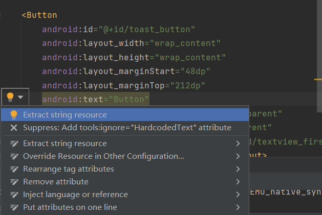

# 实验2_1_实现第一个Kotlin应用

1.  掌握Android Studio开发应用的基本流程
2. 掌握Android Studio开发组件的基本用法
3.  初始Kotlin语言的基本要素
4.  掌握Android Navigation的基本用法

------

[TOC]

------

### 1.创建第一个Kotlin应用程序

#### （1）创建一个新的工程

打开Android Studio，选择Projects>New Project，然后选择Basic Activity.


点击Next，为应用程序命名（例如：My First App），选择**Kotlin**语言，然后点击Finish。


#### （2）在模拟器上运行应用程序

运行结果：


### 2.向页面添加更多的布局

#### （1）添加按钮和约束

从Palette面板中拖动Button到,调整Button的约束，设置Button的Top>BottonOf textView，随后添加Button的左侧约束至屏幕的左侧，Button的底部约束至屏幕的底部。修改将id从button修改为toast_button（注意修改id将重构代码）


#### （2）调整Next按钮

1. 删除Next按钮与TextView 间的链

2. 删除Next按钮的左侧约束

3. 添加Next的右边和底部约束至父类屏幕（如果不存在的话），Next的Top约束至TextView的底部。最后，TextView的底部约束至屏幕的底部。

   

   

#### （3）更改组件的文本

1. fragment_first.xml布局文件代码中，找到toast_button按钮的text属性部分,点击文本，左侧出现灯泡状的提示，选择 **Extract string resource**。

   

2. 令资源名为toast_button_text，资源值为Toast，并点击OK。

   

   

#### （4）更新Next按钮

在属性面板中更改Next按钮的id，从button_first改为random_button。


在string.xml文件，右键**next**字符串资源，选择 **Refactor > Rename**，修改资源名称为**random_button_text**，点击**Refactor** 。随后，修改**Next**值为**Random**。


#### （5）添加第三个按钮

向fragment_first.xml文件中添加第三个按钮，位于Toast和Random按钮之间，TextView的下方。新Button的左右约束分别约束至Toast和Random，Top约束至TextView的底部，Buttom约束至屏幕的底部，效果如下：


#### （6）完善UI组件的属性设置

更改新增按钮id为**count_button**，显示字符串为**Count**，对应字符串资源值为**count_button_text**。


同时更同时，更改TextView的文本为 **0**。

```kotlin
<string name="hello_first_fragment">0</string>
```

修改后的fragment_first.xml的代码:

```kotlin
<?xml version="1.0" encoding="utf-8"?>
<androidx.constraintlayout.widget.ConstraintLayout xmlns:android="http://schemas.android.com/apk/res/android"
    xmlns:app="http://schemas.android.com/apk/res-auto"
    xmlns:tools="http://schemas.android.com/tools"
    android:layout_width="match_parent"
    android:layout_height="match_parent"
    tools:context=".FirstFragment">

    <TextView
        android:id="@+id/textview_first"
        android:layout_width="wrap_content"
        android:layout_height="wrap_content"
        android:fontFamily="sans-serif-condensed"
        android:text="@string/hello_first_fragment"
        android:textColor="@android:color/darker_gray"
        android:textSize="30sp"
        android:textStyle="bold"
        app:layout_constraintBottom_toBottomOf="parent"
        app:layout_constraintEnd_toEndOf="parent"
        app:layout_constraintStart_toStartOf="parent"
        app:layout_constraintTop_toTopOf="parent" />

    <Button
        android:id="@+id/random_button"
        android:layout_width="wrap_content"
        android:layout_height="wrap_content"
        android:text="@string/random_button_text"
        app:layout_constraintBottom_toBottomOf="parent"
        app:layout_constraintEnd_toEndOf="parent"
        app:layout_constraintTop_toBottomOf="@+id/textview_first"
         />

    <Button
        android:id="@+id/toast_button"
        android:layout_width="wrap_content"
        android:layout_height="wrap_content"
        android:text="@string/toast_button_text"
        app:layout_constraintBottom_toBottomOf="parent"
        app:layout_constraintStart_toStartOf="parent"
        app:layout_constraintTop_toBottomOf="@+id/textview_first" />

    <Button
        android:id="@+id/count_button"
        android:layout_width="wrap_content"
        android:layout_height="wrap_content"
        android:text="@string/count_button_text"
        app:layout_constraintBottom_toBottomOf="parent"
        app:layout_constraintEnd_toStartOf="@+id/random_button"
        app:layout_constraintStart_toEndOf="@+id/toast_button"
        app:layout_constraintTop_toBottomOf="@+id/textview_first"
         />
</androidx.constraintlayout.widget.ConstraintLayout>
```

查看运行效果：


### 3.更新按钮和文本框的外观

#### （1）添加新的颜色资源

进入app>values>colors.xml，添加蓝色阴影色screenBackground 值为 #2196F3，这是；添加新颜色buttonBackground 值为 #BBDEFB

```kotlin
 <color name="screenBackground">#2196F3</color>
 <color name="buttonBackground">#BBDEFB</color>
```

#### （2）设置组件的外观

1.进入>app>res>layout>fragment_first.xml，设置屏幕背景色：

```kotlin
<androidx.constraintlayout.widget.ConstraintLayout xmlns:android="http://schemas.android.com/apk/res/android"
    xmlns:app="http://schemas.android.com/apk/res-auto"
    xmlns:tools="http://schemas.android.com/tools"
    android:layout_width="match_parent"
    android:layout_height="match_parent"
    tools:context=".FirstFragment"
    android:background="@color/screenBackground"
    >
```

2.为每个按钮添加背景色，在<Button中添加：

```kotlin
android:background="@color/buttonBackground"
```

**注意：**

设置按钮背景色时遇到：**Insufficient text color contrast ratio** 问题，需修改app>res>values>themes.xml的style值，添加**.Bridge**，如下：

```kotlin
<style name="Theme.MyFirstApplication" parent="Theme.MaterialComponents.DayNight.DarkActionBar.Bridge">
```

3.移除TextView的背景颜色，设置TextView的文本颜色为color/white，并增大字体大小至72sp

#### （3）设置组件的位置

1.将Toast与屏幕的左边距设置为24dp，Random与屏幕的右边距设置为24dp

2.设置TextView的垂直偏移为0.3。

#### （4）运行应用程序

运行效果如下：


### 4.添加代码完成应用程序交互

#### （1）TOAST按钮添加一个toast消息

打开FirstFragment.kt文件，在onViewCreated方法中为TOAST按钮添加事件，使用**findViewById()**查找按钮id，代码如下：

```kotlin
// find the toast_button by its ID and set a click listener
        view.findViewById<Button>(R.id.toast_button).setOnClickListener {
            // create a Toast with some text, to appear for a short time
            val myToast = Toast.makeText(context, "Hello Toast!", Toast.LENGTH_LONG)
            // show the Toast
            myToast.show()
        }
```


#### （2）使Count按钮更新屏幕的数字

在FirstFragment.kt文件，为count_buttion按钮添加事件，使其可以更新Textview的文本显示，代码如下：

```kotlin
view.findViewById<Button>(R.id.count_button).setOnClickListener {
            countMe(view)
        }
```

其中**countMe()**为自定义方法，以View为参数，每次点击增加数字1，具体代码为：

```kotlin
private fun countMe(view: View) {
        // Get the text view
        val showCountTextView = view.findViewById<TextView>(R.id.textview_first)

        // Get the value of the text view.
        val countString = showCountTextView.text.toString()

        // Convert value to a number and increment it
        var count = countString.toInt()
        count++

        // Display the new value in the text view.
        showCountTextView.text = count.toString()
    }
```


### 5.完成第二界面的代码

#### （1）向界面添加TextView显示随机数

1. 打开fragment_second.xml,去掉TextView和Button之间的约束
2. 去掉TextView和Button之间的约束
3. 设置新的TextView的id为**@+id/textview_random**
4. 设置新的TextView的左右约束至屏幕的左右侧，Top约束至textview_second的Bottom，Bottom约束至Button的Top
5. 设置新的TextView的字体颜色textColor属性为**@android:color/white**，**textSize**为**72sp**，**textStyle**为**bold**，显示文字为**R**，垂直偏移量**layout_constraintVertical_bias**为 **0.45**

新增TextView最终的属性代码：

```kotlin
<TextView
        android:id="@+id/textview_random"
        android:layout_width="wrap_content"
        android:layout_height="wrap_content"
        android:text="R"
        android:textColor="@android:color/white"
        android:textSize="72sp"
        android:textStyle="bold"
        app:layout_constraintBottom_toTopOf="@+id/button_second"
        app:layout_constraintEnd_toEndOf="parent"
        app:layout_constraintStart_toStartOf="parent"
        app:layout_constraintTop_toBottomOf="@+id/textview_second"
        app:layout_constraintVertical_bias="0.45" />
```

#### （2）更新显示界面文本的TextView(textview_second)

1.更改textview_second文本框 id 为：textview_header

2.设置layout_width为**match_parent**，layout_height为**wrap_content**，设置top，left和right的margin为24dp。


3.向colors.xml添加颜色colorPrimaryDark，并将TextView颜色设置为@color/colorPrimaryDark，字体大小为**24sp**，代码如下：

```kotlin
<color name="colorPrimaryDark">#3700B3</color>
```

4.strings.xml文件中，修改`hello_second_fragment`的值为"`Here is a random number between 0 and %d.`

5.使用**Refactor>Rename**将`hello_second_fragment` 重构为`random_heading`

最终Textview的代码如下：

```kotlin
<TextView
        android:id="@+id/textview_header"
        android:layout_width="match_parent"
        android:layout_height="wrap_content"
        android:layout_marginStart="24dp"
        android:layout_marginLeft="24dp"
        android:layout_marginTop="24dp"
        android:layout_marginEnd="24dp"
        android:layout_marginRight="24dp"
        android:text="@string/random_heading"
        android:textColor="@color/colorPrimaryDark"
        android:textSize="24sp"
        app:layout_constraintEnd_toEndOf="parent"
        app:layout_constraintStart_toStartOf="parent"
        app:layout_constraintTop_toTopOf="parent" />
```


#### （3）更改界面的背景色和按钮布局

1.向colors.xml文件添加第二个Fragment背景色的值，修改fragment_second.xml背景色的属性为`screenBackground2`

```kotlin
<color name="screenBackground2">#26C6DA</color>
```

2.调整布局至美观，界面如下：


#### （4）启用SafeArgs

1. 首先打开 **Gradle Scripts > build.gradle (Project: MyFirstAppliaction)**

2. 在plugins节添加：

   ```kotlin
   id 'androidx.navigation.safeargs' version '2.4.1' apply false
   ```

   

3. 接着打开 **Gradle Scripts > build.gradle (Module: app)**，在module部分在plugins节添加：

   ```kotlin
   id 'androidx.navigation.safeargs'
   ```

4. 点击 **Sync Project with Gradle Files**同步依赖库

5. 重新生成工程**Build > Make Project**

 

#### （5）创建导航动作的参数

1. 查看`SecondFragment`的属性栏

2. 点击Arguments  **+ ** 符号

3. 添加参数myArg，类型为整型Integer，如下图：

   
   
   

#### （6）FirstFragment添加代码，向SecondFragment发数据

**目的：**获取当前TextView中显示的数字并传输至SecondFragment。

**步骤**：

1. 打开FirstFragment.kt源代码文件

2. 找到onViewCreated()方法，该方法在onCreateView方法之后被调用，可以实现组件的初始化。找到Random按钮的响应代码，注释掉原先的事件处理代码

3. 实例化TextView，获取TextView中文本并转换为整数值

   ```kotlin
   val showCountTextView = view.findViewById<TextView>(R.id.textview_first)
   val currentCount = showCountTextView.text.toString().toInt()
   ```

4. 将`currentCount`作为参数传递给actionFirstFragmentToSecondFragment()

   ```kotlin
   val action = FirstFragmentDirections.actionFirstFragmentToSecondFragment(currentCount)
   
   ```

5. 添加导航事件代码

   ```kotlin
   findNavController().navigate(action)
   ```

最终更改完后，``binding.randomButton.setOnClickListener`` 代码如下：

```kotlin
binding.randomButton.setOnClickListener {
           // findNavController().navigate(R.id.action_FirstFragment_to_SecondFragment)
            val showCountTextView = view.findViewById<TextView>(R.id.textview_first)
            val currentCount = showCountTextView.text.toString().toInt()
            val action = FirstFragmentDirections.actionFirstFragmentToSecondFragment(currentCount)
            findNavController().navigate(action)
        }
```


#### （7）添加SecondFragment的代码

**目的：**接受传递过来的整型参数并进行处理

**步骤：**

1. 导入navArgs包

   ```kotlin
   import androidx.navigation.fragment.navArgs
   ```

2. 在`onViewCreated()`代码之前添加：

   ```kotlin
   val args: SecondFragmentArgs by navArgs()
   ```

3. 通过`onViewCreated()`中获取传递过来的参数列表，提取count数值，并在textview_header中显示

   ```kotlin
   val count = args.myArg
   val countText = getString(R.string.random_heading, count)
   view.findViewById<TextView>(R.id.textview_header).text = countText
   ```

4. 根据count值生成随机数

   ```kotlin
   val random = java.util.Random()
   var randomNumber = 0
   if (count > 0) {
      randomNumber = random.nextInt(count + 1)
   }
   ```

5. textview_random中显示count值:

   ```kotlin
   view.findViewById<TextView>(R.id.textview_random).text = randomNumber.toString()
   ```

最终更改完后，``onViewCreated``代码如下：

```kotlin
override fun onViewCreated(view: View, savedInstanceState: Bundle?) {
        super.onViewCreated(view, savedInstanceState)
        val count = args.myArg
        val countText = getString(R.string.random_heading, count)
        view.findViewById<TextView>(R.id.textview_header).text = countText

        val random = java.util.Random()
        var randomNumber = 0
        if (count > 0) {
            randomNumber = random.nextInt(count + 1)
        }

        view.findViewById<TextView>(R.id.textview_random).text = randomNumber.toString()
        binding.buttonSecond.setOnClickListener {
            findNavController().navigate(R.id.action_SecondFragment_to_FirstFragment)
        }
    }
```


**运行结果：**

