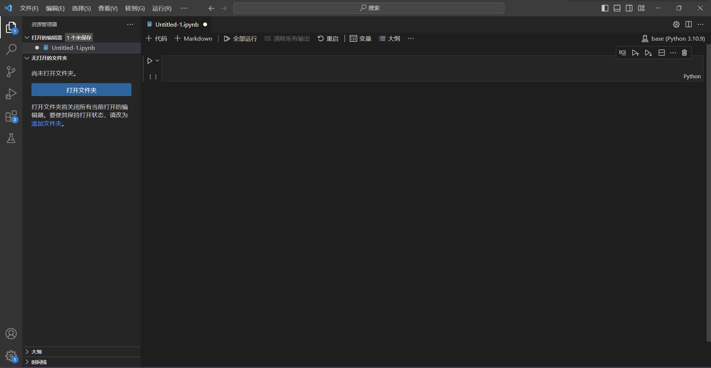

# 实验3 Jupyter Notebook实践

1. 掌握Notebook工具的基本原理
2. 学习Python基本语法，完成选择排序程序
3. 完成Python数据分析的例子

------

### 1.创建一个新的Notebook

在VS Code中新建一个Notebook,界面如下：




### 2.实现简单的Python 程序的例子
**步骤：**
1.定义selection_sort函数执行选择排序功能。


```python
def selectionSort(arr):
    n = len(arr)
    for i in range(n-1): 
        # 索引从0到n-2,每一轮在该位置都会放每轮找到的最小值
        minIndex = i
        for j in range(i+1,n):
            if arr[j] < arr[minIndex]:  # 寻找最小数
                minIndex = j            # 将最小值的索引保存
        arr[i], arr[minIndex] = arr[minIndex], arr[i]
    return arr

```

2.定义test函数进行测试，执行数据输入，并调用selection_sort函数进行排序，最后输出结果。


```python
import random
mylist =[random.randint(0,1000)for i in range(20)] #随机生成20个0-1000内的随机数
print(selectionSort(mylist))
```

    [3, 61, 94, 147, 153, 165, 217, 415, 479, 574, 665, 728, 761, 779, 800, 819, 867, 881, 934, 957]


### 3.完成数据分析的例子

#### 1）导入相关的工具库


```python
%matplotlib inline
import pandas as pd
import matplotlib.pyplot as plt
import seaborn as sns

```

### 4.检查数据集
**1）加载数据集**


```python
df = pd.read_csv('D:\\fortune500.csv')
```

**2） 查看数据**


```python
df.head() #查看前5行数据
```


<div>
<style scoped>
    .dataframe tbody tr th:only-of-type {
        vertical-align: middle;
    }

    .dataframe tbody tr th {
        vertical-align: top;
    }
    
    .dataframe thead th {
        text-align: right;
    }
</style>
<table border="1" class="dataframe">
  <thead>
    <tr style="text-align: right;">
      <th></th>
      <th>Year</th>
      <th>Rank</th>
      <th>Company</th>
      <th>Revenue (in millions)</th>
      <th>Profit (in millions)</th>
    </tr>
  </thead>
  <tbody>
    <tr>
      <th>0</th>
      <td>1955</td>
      <td>1</td>
      <td>General Motors</td>
      <td>9823.5</td>
      <td>806</td>
    </tr>
    <tr>
      <th>1</th>
      <td>1955</td>
      <td>2</td>
      <td>Exxon Mobil</td>
      <td>5661.4</td>
      <td>584.8</td>
    </tr>
    <tr>
      <th>2</th>
      <td>1955</td>
      <td>3</td>
      <td>U.S. Steel</td>
      <td>3250.4</td>
      <td>195.4</td>
    </tr>
    <tr>
      <th>3</th>
      <td>1955</td>
      <td>4</td>
      <td>General Electric</td>
      <td>2959.1</td>
      <td>212.6</td>
    </tr>
    <tr>
      <th>4</th>
      <td>1955</td>
      <td>5</td>
      <td>Esmark</td>
      <td>2510.8</td>
      <td>19.1</td>
    </tr>
  </tbody>
</table>
</div>


```python
df.tail() #查看后5行数据
```


<div>
<style scoped>
    .dataframe tbody tr th:only-of-type {
        vertical-align: middle;
    }

    .dataframe tbody tr th {
        vertical-align: top;
    }
    
    .dataframe thead th {
        text-align: right;
    }
</style>
<table border="1" class="dataframe">
  <thead>
    <tr style="text-align: right;">
      <th></th>
      <th>Year</th>
      <th>Rank</th>
      <th>Company</th>
      <th>Revenue (in millions)</th>
      <th>Profit (in millions)</th>
    </tr>
  </thead>
  <tbody>
    <tr>
      <th>25495</th>
      <td>2005</td>
      <td>496</td>
      <td>Wm. Wrigley Jr.</td>
      <td>3648.6</td>
      <td>493</td>
    </tr>
    <tr>
      <th>25496</th>
      <td>2005</td>
      <td>497</td>
      <td>Peabody Energy</td>
      <td>3631.6</td>
      <td>175.4</td>
    </tr>
    <tr>
      <th>25497</th>
      <td>2005</td>
      <td>498</td>
      <td>Wendy's International</td>
      <td>3630.4</td>
      <td>57.8</td>
    </tr>
    <tr>
      <th>25498</th>
      <td>2005</td>
      <td>499</td>
      <td>Kindred Healthcare</td>
      <td>3616.6</td>
      <td>70.6</td>
    </tr>
    <tr>
      <th>25499</th>
      <td>2005</td>
      <td>500</td>
      <td>Cincinnati Financial</td>
      <td>3614.0</td>
      <td>584</td>
    </tr>
  </tbody>
</table>
</div>


对数据属性列进行重命名，以便在后续访问


```python
df.columns = ['year', 'rank', 'company', 'revenue', 'profit']
```

检查数据条目是否加载完整。


```python
len(df)
```


    25500


从1955至2055年总共有25500条目录。然后，检查属性列的类型。


```python
df.dtypes
```


    year         int64
    rank         int64
    company     object
    revenue    float64
    profit      object
    dtype: object


**3）清洗数据**
对于profit属性，期望的结果是float类型，因此其可能包含非数字的值，利用正则表达式进行检查。


```python
non_numberic_profits = df.profit.str.contains('[^0-9.-]')
df.loc[non_numberic_profits].head()
```


<div>
<style scoped>
    .dataframe tbody tr th:only-of-type {
        vertical-align: middle;
    }

    .dataframe tbody tr th {
        vertical-align: top;
    }
    
    .dataframe thead th {
        text-align: right;
    }
</style>
<table border="1" class="dataframe">
  <thead>
    <tr style="text-align: right;">
      <th></th>
      <th>year</th>
      <th>rank</th>
      <th>company</th>
      <th>revenue</th>
      <th>profit</th>
    </tr>
  </thead>
  <tbody>
    <tr>
      <th>228</th>
      <td>1955</td>
      <td>229</td>
      <td>Norton</td>
      <td>135.0</td>
      <td>N.A.</td>
    </tr>
    <tr>
      <th>290</th>
      <td>1955</td>
      <td>291</td>
      <td>Schlitz Brewing</td>
      <td>100.0</td>
      <td>N.A.</td>
    </tr>
    <tr>
      <th>294</th>
      <td>1955</td>
      <td>295</td>
      <td>Pacific Vegetable Oil</td>
      <td>97.9</td>
      <td>N.A.</td>
    </tr>
    <tr>
      <th>296</th>
      <td>1955</td>
      <td>297</td>
      <td>Liebmann Breweries</td>
      <td>96.0</td>
      <td>N.A.</td>
    </tr>
    <tr>
      <th>352</th>
      <td>1955</td>
      <td>353</td>
      <td>Minneapolis-Moline</td>
      <td>77.4</td>
      <td>N.A.</td>
    </tr>
  </tbody>
</table>
</div>


统计profit包含非数字的值的记录数。


```python
len(df.profit[non_numberic_profits])
```


    369


更进一步，使用直方图显示一下按照年份的分布情况。


```python
bin_sizes, _, _ = plt.hist(df.year[non_numberic_profits], bins=range(1955, 2006))
```


    


可见，单独年份这样的记录数都少于25条，即少于4%的比例。这在可以接受的范围内，因此删除这些记录。


```python
df = df.loc[~non_numberic_profits]
df.profit = df.profit.apply(pd.to_numeric)
```

再次检查数据记录的条目数。


```python
len(df)
```


    25131


```python
df.dtypes
```


    year         int64
    rank         int64
    company     object
    revenue    float64
    profit     float64
    dtype: object


### 5.使用matplotlib进行绘图
1）以年分组绘制平均利润和收入。首先定义变量和方法。


```python
group_by_year = df.loc[:, ['year', 'revenue', 'profit']].groupby('year')
avgs = group_by_year.mean()
x = avgs.index
y1 = avgs.profit
def plot(x, y, ax, title, y_label):
    ax.set_title(title)
    ax.set_ylabel(y_label)
    ax.plot(x, y)
    ax.margins(x=0, y=0)
```

2）绘制利润曲线


```python
fig, ax = plt.subplots()
plot(x, y1, ax, 'Increase in mean Fortune 500 company profits from 1955 to 2005', 'Profit (millions)')
```


    


3）绘制收入曲线


```python
y2 = avgs.revenue
fig, ax = plt.subplots()
plot(x, y2, ax, 'Increase in mean Fortune 500 company revenues from 1955 to 2005', 'Revenue (millions)')
```


    


由图可看出：在利润曲线图中，利润在1990年代初期出现急剧的下滑，对应当时经济衰退和网络泡沫，但是在收入曲线图中，公司收入曲线并没有出现急剧下降。

4）对数据结果进行标准差处理


```python
def plot_with_std(x, y, stds, ax, title, y_label):
    ax.fill_between(x, y - stds, y + stds, alpha=0.2)
    plot(x, y, ax, title, y_label)
fig, (ax1, ax2) = plt.subplots(ncols=2)
title = 'Increase in mean and std Fortune 500 company %s from 1955 to 2005'
stds1 = group_by_year.std().profit.values
stds2 = group_by_year.std().revenue.values
plot_with_std(x, y1.values, stds1, ax1, title % 'profits', 'Profit (millions)')
plot_with_std(x, y2.values, stds2, ax2, title % 'revenues', 'Revenue (millions)')
fig.set_size_inches(14, 4)
fig.tight_layout()
```


    


可见，不同公司之间的收入和利润差距惊人。
