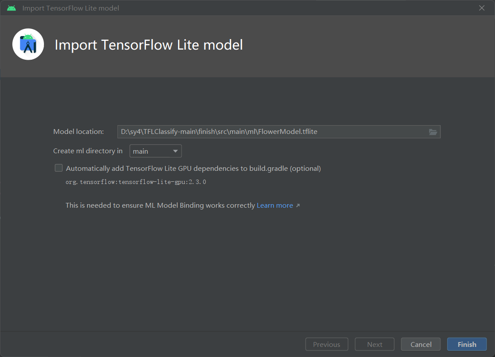
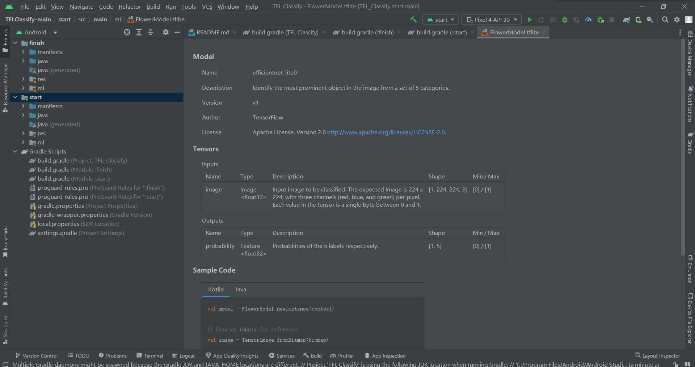
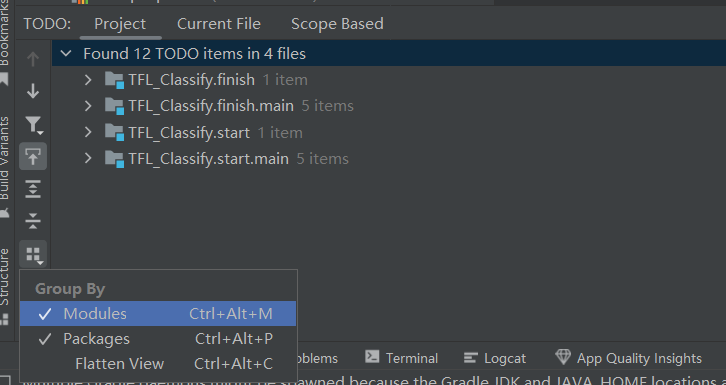
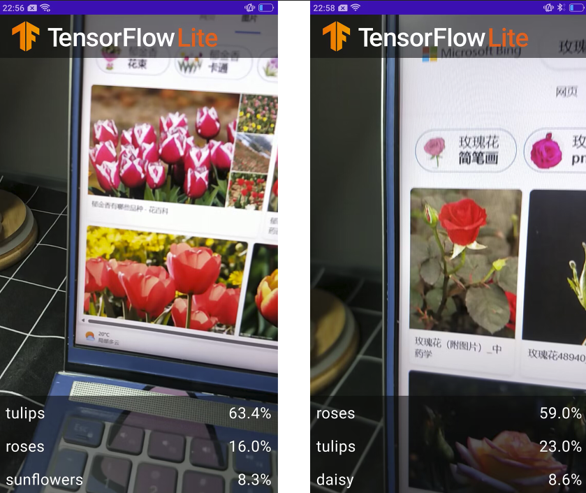

# 实现的Android花卉识别应用

1. 构建基于TensorFlow Lite的Android花卉识别应用。
2. 学习了解CameraX 库 (AndroidX.camera.*)和数据视图模型的使用。

------

### 1.向应用中添加TensorFlow Lite

1. 在“start”模块中添加：TensorFlow Lite Model，步骤：右键“start”模块>New>Other>TensorFlow Lite Model。

2. 选择已经下载的自定义的训练模型，这里选择finish模块中ml文件下的FlowerModel.tflite。

   

   ​                                             

3. 最终TensorFlow Lite模型被成功导入，并生成摘要信息

   

   

### 2.检查代码中的TODO项

1. View>Tool Windows>TODO，按照模块分组（Group By）

   

   

### 3.添加代码重新运行APP

1. 在“start”模块**MainActivity.kt**文件的TODO 1中，添加初始化训练模型的代码

   ```kotlin
   private val flowerModel = FlowerModel.newInstance(ctx)
   ```

2. 在CameraX的analyze方法内部，需要将摄像头的输入`ImageProxy`转化为`Bitmap`对象，并进一步转化为`TensorImage` 对象

   ```kotlin
   val tfImage = TensorImage.fromBitmap(toBitmap(imageProxy))
   ```

3. 对图像进行处理并生成结果，主要包含下述操作：

   - 按照属性`score`对识别结果按照概率从高到低排序
   - 列出最高k种可能的结果，k的结果由常量`MAX_RESULT_DISPLAY`定义

   代码：

   ```kotlin
   val outputs = flowerModel.process(tfImage)
         .probabilityAsCategoryList.apply {
             sortByDescending { it.score } // Sort with highest confidence first
         }.take(MAX_RESULT_DISPLAY) // take the top results
   ```

4. 将识别的结果加入数据对象`Recognition` 中，包含`label`和`score`两个元素。后续将用于`RecyclerView`的数据显示

   ```kotlin
   for (output in outputs) {
         items.add(Recognition(output.label, output.score))
     }
   ```

5. 将原先用于虚拟显示识别结果的代码(见下方)注释掉或者删除

   ```kotlin
   for (i in 0..MAX_RESULT_DISPLAY-1){
       items.add(Recognition("Fake label $i", Random.nextFloat()))
   }
   ```

6. 重启物理设备，查看运行结果

   


   利用该App对郁金香和玫瑰两种花卉进行识别，识别成功率分别为63.4%和59.0%，说明App具有一定的准确性。