# 实验5_1:TensorFlow Lite 模型生成

1.了解机器学习基础

2.了解TensorFlow及TensorFlow Lite

3.完成基于TensorFlow Lite Model Maker的花卉 模型生成

------


## 预备工作

#### 1.codespace使用及相关配置

1. 在github页面，新建codespace

2. 通过Conda创建一个新的Python3.8的环境，这里我将其命名为mypy

   ```
   conda create -n mypy python=3.8
   ```

3. 激活我们新建的myoy虚拟环境

   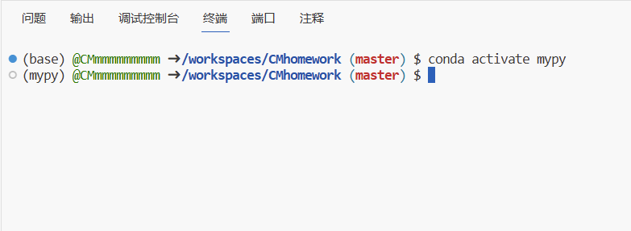

4. 安装tflite-model-maker库

   ```python
   !pip install tflite-model-maker
   ```

   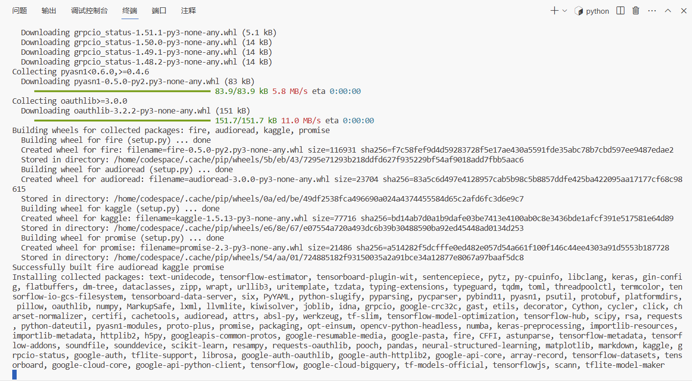

5. 导入相关的库。

   ```python
   import os
   
   import numpy as np
   
   import tensorflow as tf
   assert tf.__version__.startswith('2')
   
   from tflite_model_maker import model_spec
   from tflite_model_maker import image_classifier
   from tflite_model_maker.config import ExportFormat
   from tflite_model_maker.config import QuantizationConfig
   from tflite_model_maker.image_classifier import DataLoader
   
   import matplotlib.pyplot as plt
   
   ```


### 在导入相关库的时候有遇到如下几个问题：

1.提示numpy找不到属性问题

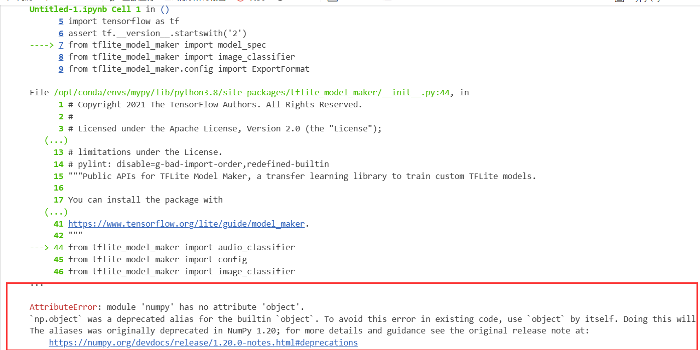


**解决方案：**将numpy版本更改为1.23

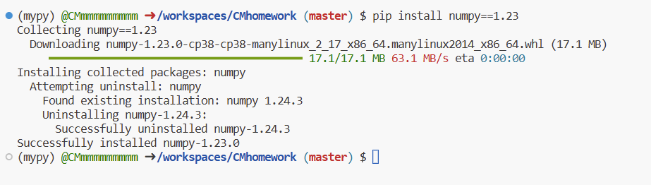

2.ImportError:找不到 libusb-1.0包问题

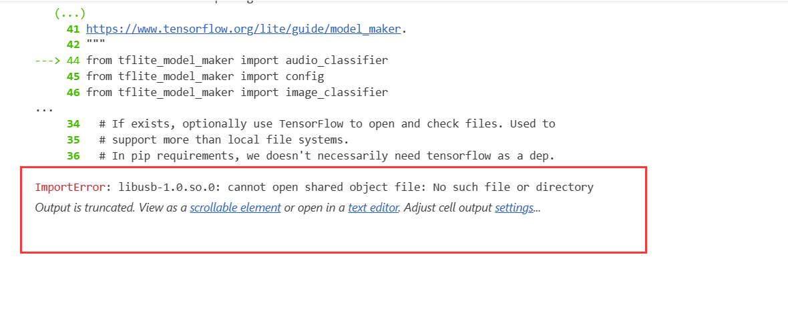

**解决方案：**下载包 libusb-1.0-0

```
1.sudo apt update
2.sudo apt install libusb-1.0-0
```

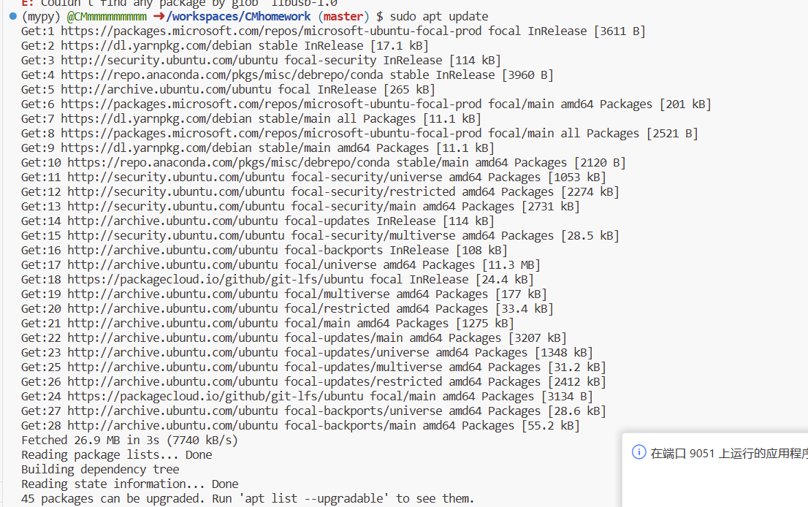

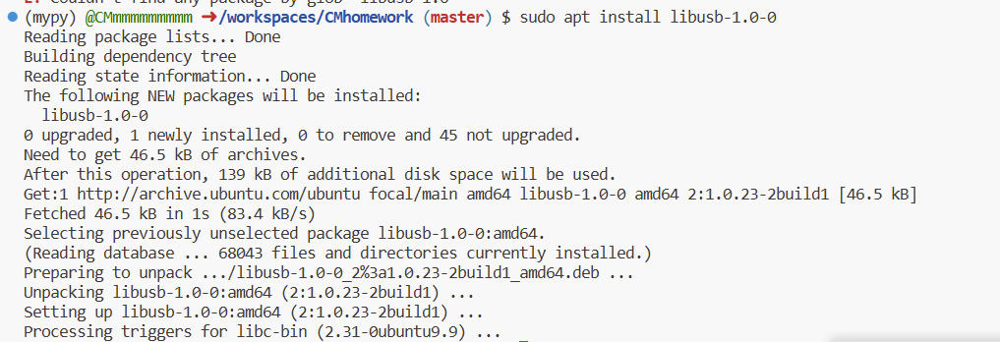


解决完以上两个问题后便可以正常导入：

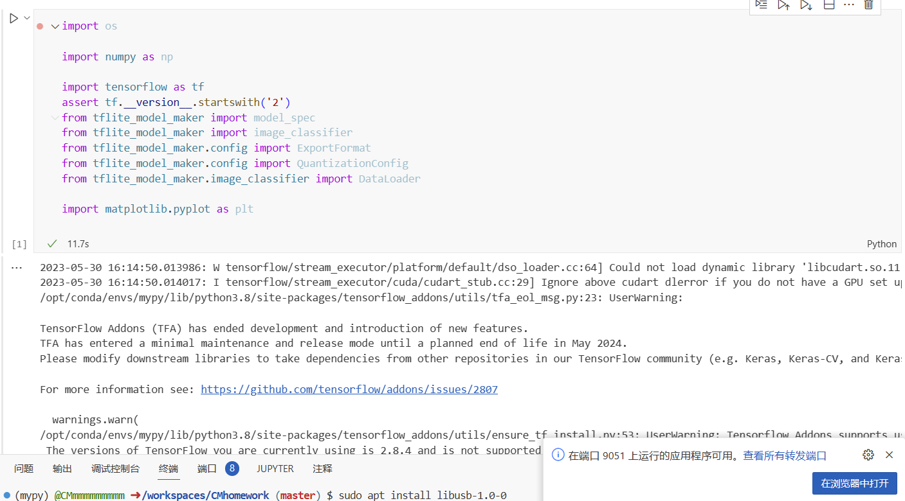


## 模型训练

### 获取数据

```python
image_path = tf.keras.utils.get_file(
      'flower_photos.tgz',
      'https://storage.googleapis.com/download.tensorflow.org/example_images/flower_photos.tgz',
      extract=True)
image_path = os.path.join(os.path.dirname(image_path), 'flower_photos')

```

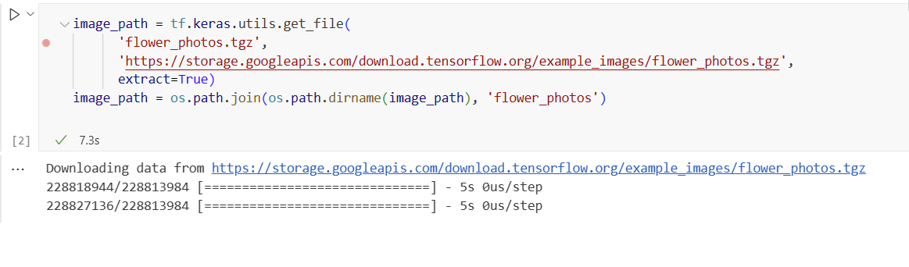

### 运行示例

1. 加载数据集，并将数据集分为训练数据和测试数据。

   ```python
   data = DataLoader.from_folder(image_path)
   train_data, test_data = data.split(0.9)
   ```

   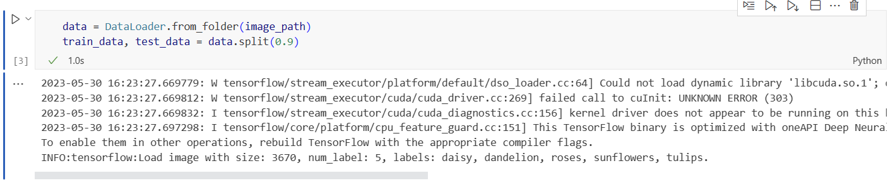

2. 训练Tensorflow模型

   ```python
   model = image_classifier.create(train_data)
   ```

   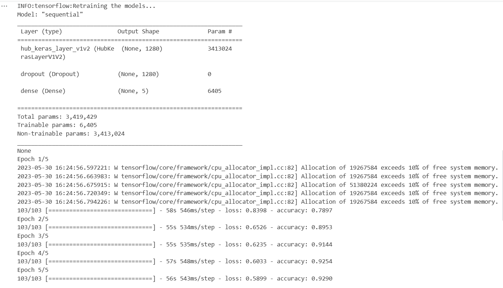

3. 评估模型

   ```python
   loss, accuracy = model.evaluate(test_data)
   ```

   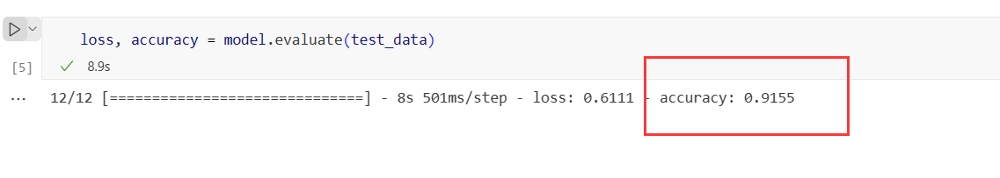

4. 导出Tensorflow Lite模型

   ```python
   model.export(export_dir='.')
   ```

   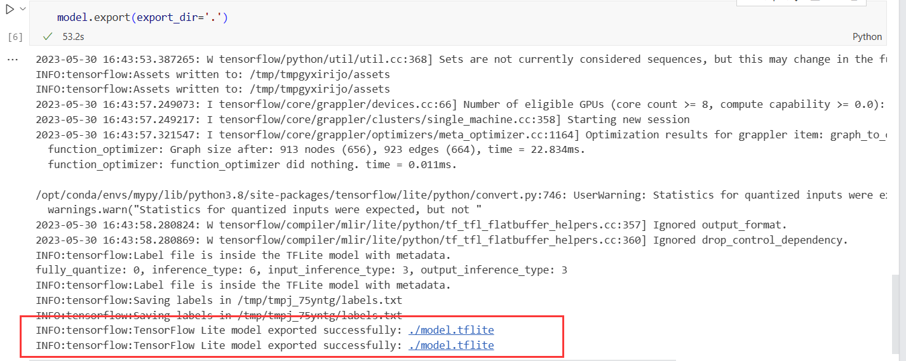

