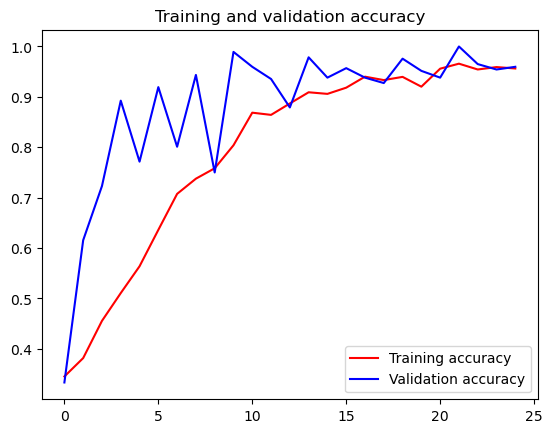

# 实验5_2 TensorFlow 石头剪刀布模型生成

1.进一步掌握TensorFlow模型训练和生成的基本流程

2.学习石头剪刀布图片识别模型的生成

3.绘制图像验证模型的性能

------

### 1.前期准备工作

1.石头剪刀布的数据集（训练集和测试集）下载：

```
!wget --no-check-certificate https://storage.googleapis.com/learning-datasets/rps.zip -O D:/Game/rps.zip
  
!wget --no-check-certificate https://storage.googleapis.com/learning-datasets/rps-test-set.zip -O D:/Game/rps-test-set.zip
```

2.利用python解压下载的数据集。


```python
import os
import zipfile

local_zip = 'D:/sy5/sy5_2/rps.zip'
zip_ref = zipfile.ZipFile(local_zip, 'r')
zip_ref.extractall('D:/sy5/sy5_2')
zip_ref.close()

local_zip = 'D:/sy5/sy5_2/rps-test-set.zip'
zip_ref = zipfile.ZipFile(local_zip, 'r')
zip_ref.extractall('D:/sy5/sy5_2/')
zip_ref.close()
```

3.检测数据集的解压结果，打印相关信息。


```python
rock_dir = os.path.join('D:/sy5/sy5_2/rps/rock')
paper_dir = os.path.join('D:/sy5/sy5_2/rps/paper')
scissors_dir = os.path.join('D:/sy5/sy5_2/rps/scissors')

print('total training rock images:', len(os.listdir(rock_dir)))
print('total training paper images:', len(os.listdir(paper_dir)))
print('total training scissors images:', len(os.listdir(scissors_dir)))

rock_files = os.listdir(rock_dir)
print(rock_files[:10])

paper_files = os.listdir(paper_dir)
print(paper_files[:10])

scissors_files = os.listdir(scissors_dir)
print(scissors_files[:10])
```

**运行结果：**

    total training rock images: 840
    total training paper images: 840
    total training scissors images: 840
    ['rock01-000.png', 'rock01-001.png', 'rock01-002.png', 'rock01-003.png', 'rock01-004.png', 'rock01-005.png', 'rock01-006.png', 'rock01-007.png', 'rock01-008.png', 'rock01-009.png']
    ['paper01-000.png', 'paper01-001.png', 'paper01-002.png', 'paper01-003.png', 'paper01-004.png', 'paper01-005.png', 'paper01-006.png', 'paper01-007.png', 'paper01-008.png', 'paper01-009.png']
    ['scissors01-000.png', 'scissors01-001.png', 'scissors01-002.png', 'scissors01-003.png', 'scissors01-004.png', 'scissors01-005.png', 'scissors01-006.png', 'scissors01-007.png', 'scissors01-008.png', 'scissors01-009.png']

4.各打印两张石头剪刀布训练集图片。


```python
%matplotlib inline

import matplotlib.pyplot as plt
import matplotlib.image as mpimg

pic_index = 2

next_rock = [os.path.join(rock_dir, fname) 
                for fname in rock_files[pic_index-2:pic_index]]
next_paper = [os.path.join(paper_dir, fname) 
                for fname in paper_files[pic_index-2:pic_index]]
next_scissors = [os.path.join(scissors_dir, fname) 
                for fname in scissors_files[pic_index-2:pic_index]]

for i, img_path in enumerate(next_rock+next_paper+next_scissors):
  #print(img_path)
  img = mpimg.imread(img_path)
  plt.imshow(img)
  plt.axis('Off')
  plt.show()

```


    


    


    


    


    


    

### 2.模型训练及绘制：

1.下载tensorflow以及keras preprocessing相关库包。

```
! pip install keras_preprocessing -i https://mirrors.aliyun.com/pypi/simple

! pip install tensorflow -i https://mirrors.aliyun.com/pypi/simple
```

2.调用TensorFlow的keras进行数据模型的训练和评估。


```python
import tensorflow as tf
import keras_preprocessing
from keras_preprocessing import image
from keras_preprocessing.image import ImageDataGenerator

TRAINING_DIR = "D:/sy5/sy5_2/rps/"
training_datagen = ImageDataGenerator(
      rescale = 1./255,
	    rotation_range=40,
      width_shift_range=0.2,
      height_shift_range=0.2,
      shear_range=0.2,
      zoom_range=0.2,
      horizontal_flip=True,
      fill_mode='nearest')

VALIDATION_DIR = "D:/sy5/sy5_2/rps-test-set/"
validation_datagen = ImageDataGenerator(rescale = 1./255)

train_generator = training_datagen.flow_from_directory(
	TRAINING_DIR,
	target_size=(150,150),
	class_mode='categorical',
  batch_size=126
)

validation_generator = validation_datagen.flow_from_directory(
	VALIDATION_DIR,
	target_size=(150,150),
	class_mode='categorical',
  batch_size=126
)

model = tf.keras.models.Sequential([
    # Note the input shape is the desired size of the image 150x150 with 3 bytes color
    # This is the first convolution
    tf.keras.layers.Conv2D(64, (3,3), activation='relu', input_shape=(150, 150, 3)),
    tf.keras.layers.MaxPooling2D(2, 2),
    # The second convolution
    tf.keras.layers.Conv2D(64, (3,3), activation='relu'),
    tf.keras.layers.MaxPooling2D(2,2),
    # The third convolution
    tf.keras.layers.Conv2D(128, (3,3), activation='relu'),
    tf.keras.layers.MaxPooling2D(2,2),
    # The fourth convolution
    tf.keras.layers.Conv2D(128, (3,3), activation='relu'),
    tf.keras.layers.MaxPooling2D(2,2),
    # Flatten the results to feed into a DNN
    tf.keras.layers.Flatten(),
    tf.keras.layers.Dropout(0.5),
    # 512 neuron hidden layer
    tf.keras.layers.Dense(512, activation='relu'),
    tf.keras.layers.Dense(3, activation='softmax')
])


model.summary()

model.compile(loss = 'categorical_crossentropy', optimizer='rmsprop', metrics=['accuracy'])

history = model.fit(train_generator, epochs=25, steps_per_epoch=20, validation_data = validation_generator, verbose = 1, validation_steps=3)

model.save("rps.h5")
```

**运行结果：**

    Found 2520 images belonging to 3 classes.
    Found 372 images belonging to 3 classes.
    Model: "sequential"
    _________________________________________________________________
     Layer (type)                Output Shape              Param #   
    =================================================================
     conv2d (Conv2D)             (None, 148, 148, 64)      1792      
                                                                     
     max_pooling2d (MaxPooling2D  (None, 74, 74, 64)       0         
     )                                                               
                                                                     
     conv2d_1 (Conv2D)           (None, 72, 72, 64)        36928     
                                                                     
     max_pooling2d_1 (MaxPooling  (None, 36, 36, 64)       0         
     2D)                                                             
                                                                     
     conv2d_2 (Conv2D)           (None, 34, 34, 128)       73856     
                                                                     
     max_pooling2d_2 (MaxPooling  (None, 17, 17, 128)      0         
     2D)                                                             
                                                                     
     conv2d_3 (Conv2D)           (None, 15, 15, 128)       147584    
                                                                     
     max_pooling2d_3 (MaxPooling  (None, 7, 7, 128)        0         
     2D)                                                             
                                                                     
     flatten (Flatten)           (None, 6272)              0         
                                                                     
     dropout (Dropout)           (None, 6272)              0         
                                                                     
     dense (Dense)               (None, 512)               3211776   
                                                                     
     dense_1 (Dense)             (None, 3)                 1539      
                                                                     
    =================================================================
    Total params: 3,473,475
    Trainable params: 3,473,475
    Non-trainable params: 0
    _________________________________________________________________
    Epoch 1/25
    20/20 [==============================] - 62s 3s/step - loss: 1.1811 - accuracy: 0.3452 - val_loss: 1.0817 - val_accuracy: 0.3333
    Epoch 2/25
    20/20 [==============================] - 50s 2s/step - loss: 1.0939 - accuracy: 0.3817 - val_loss: 1.0445 - val_accuracy: 0.6156
    Epoch 3/25
    20/20 [==============================] - 48s 2s/step - loss: 1.0339 - accuracy: 0.4556 - val_loss: 0.8052 - val_accuracy: 0.7231
    Epoch 4/25
    20/20 [==============================] - 47s 2s/step - loss: 1.0222 - accuracy: 0.5107 - val_loss: 0.6807 - val_accuracy: 0.8925
    Epoch 5/25
    20/20 [==============================] - 47s 2s/step - loss: 0.9337 - accuracy: 0.5639 - val_loss: 0.6097 - val_accuracy: 0.7715
    Epoch 6/25
    20/20 [==============================] - 48s 2s/step - loss: 0.8195 - accuracy: 0.6361 - val_loss: 0.3811 - val_accuracy: 0.9194
    Epoch 7/25
    20/20 [==============================] - 47s 2s/step - loss: 0.6625 - accuracy: 0.7075 - val_loss: 0.3467 - val_accuracy: 0.8011
    Epoch 8/25
    20/20 [==============================] - 47s 2s/step - loss: 0.6037 - accuracy: 0.7377 - val_loss: 0.1555 - val_accuracy: 0.9435
    Epoch 9/25
    20/20 [==============================] - 47s 2s/step - loss: 0.5889 - accuracy: 0.7583 - val_loss: 0.4858 - val_accuracy: 0.7500
    Epoch 10/25
    20/20 [==============================] - 47s 2s/step - loss: 0.5128 - accuracy: 0.8040 - val_loss: 0.1054 - val_accuracy: 0.9892
    Epoch 11/25
    20/20 [==============================] - 47s 2s/step - loss: 0.3613 - accuracy: 0.8687 - val_loss: 0.1508 - val_accuracy: 0.9597
    Epoch 12/25
    20/20 [==============================] - 46s 2s/step - loss: 0.3535 - accuracy: 0.8643 - val_loss: 0.1632 - val_accuracy: 0.9355
    Epoch 13/25
    20/20 [==============================] - 46s 2s/step - loss: 0.3095 - accuracy: 0.8869 - val_loss: 0.2037 - val_accuracy: 0.8790
    Epoch 14/25
    20/20 [==============================] - 47s 2s/step - loss: 0.2567 - accuracy: 0.9091 - val_loss: 0.0615 - val_accuracy: 0.9785
    Epoch 15/25
    20/20 [==============================] - 46s 2s/step - loss: 0.2488 - accuracy: 0.9060 - val_loss: 0.1629 - val_accuracy: 0.9382
    Epoch 16/25
    20/20 [==============================] - 47s 2s/step - loss: 0.2129 - accuracy: 0.9183 - val_loss: 0.0982 - val_accuracy: 0.9570
    Epoch 17/25
    20/20 [==============================] - 47s 2s/step - loss: 0.1567 - accuracy: 0.9401 - val_loss: 0.1781 - val_accuracy: 0.9382
    Epoch 18/25
    20/20 [==============================] - 47s 2s/step - loss: 0.1805 - accuracy: 0.9333 - val_loss: 0.1865 - val_accuracy: 0.9274
    Epoch 19/25
    20/20 [==============================] - 46s 2s/step - loss: 0.1645 - accuracy: 0.9397 - val_loss: 0.0851 - val_accuracy: 0.9758
    Epoch 20/25
    20/20 [==============================] - 47s 2s/step - loss: 0.2104 - accuracy: 0.9202 - val_loss: 0.1080 - val_accuracy: 0.9516
    Epoch 21/25
    20/20 [==============================] - 47s 2s/step - loss: 0.1234 - accuracy: 0.9560 - val_loss: 0.1253 - val_accuracy: 0.9382
    Epoch 22/25
    20/20 [==============================] - 46s 2s/step - loss: 0.1030 - accuracy: 0.9659 - val_loss: 0.0388 - val_accuracy: 1.0000
    Epoch 23/25
    20/20 [==============================] - 46s 2s/step - loss: 0.1360 - accuracy: 0.9544 - val_loss: 0.0479 - val_accuracy: 0.9651
    Epoch 24/25
    20/20 [==============================] - 47s 2s/step - loss: 0.1177 - accuracy: 0.9591 - val_loss: 0.1204 - val_accuracy: 0.9543
    Epoch 25/25
    20/20 [==============================] - 46s 2s/step - loss: 0.1304 - accuracy: 0.9563 - val_loss: 0.0645 - val_accuracy: 0.9597

3.完成模型训练之后，我们绘制训练和验证结果的相关信息。


```python
import matplotlib.pyplot as plt
acc = history.history['accuracy']
val_acc = history.history['val_accuracy']
loss = history.history['loss']
val_loss = history.history['val_loss']

epochs = range(len(acc))

plt.plot(epochs, acc, 'r', label='Training accuracy')
plt.plot(epochs, val_acc, 'b', label='Validation accuracy')
plt.title('Training and validation accuracy')
plt.legend(loc=0)
plt.figure()
plt.show()
```



    

    <Figure size 640x480 with 0 Axes>
